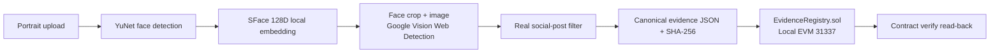

# ProofFace

Face scan → genuine reverse-image search → real social post → tamper-evident EVM record.

ProofFace is an end-to-end local pipeline built for **HH Goa 2026 Shortlisting Task 3**. It detects a face with OpenCV YuNet, creates a 128-dimensional SFace embedding, submits both the aligned face crop and source image to Google Cloud Vision Web Detection, selects a genuine matching social-media post URL, fingerprints the evidence, writes it to a Solidity contract, and immediately re-verifies the record from chain state.

There are no pre-picked search results in the application. If the configured reverse-image provider finds no public social post, the run fails clearly instead of substituting demo data.

## What judges can see

- Live face detection, five landmarks, confidence, bounding box, and 128D encoding
- A real Google Vision reverse-image request using the uploaded image
- Strict filtering for post URLs on X, Instagram, Facebook, Reddit, Pinterest, LinkedIn, Threads, TikTok, YouTube, Tumblr, and VK
- Optional second SFace comparison against provider-returned remote images
- A mined `EvidenceAnchored` transaction on an Ethereum-compatible Hardhat local chain
- Contract address, block number, transaction hash, evidence hash, and source hash
- A fresh `verify()` contract read and a deliberate tamper test that must fail
- Advanced investigation UI plus a headless CLI for an unambiguous terminal demo

## Architecture



| Layer | Implementation |
| --- | --- |
| Face detection | OpenCV YuNet `face_detection_yunet_2023mar.onnx` |
| Face encoding | OpenCV SFace `face_recognition_sface_2021dec.onnx`, normalized 128D vector |
| Reverse-image search | Google Cloud Vision `WEB_DETECTION`; local images are sent as base64, not as pre-hosted URLs |
| Match policy | Public social host + platform-specific post-path pattern + full/partial provider match; SFace remote-image confirmation when accessible |
| Evidence fingerprint | Canonically sorted JSON, SHA-256 evidence hash, separate SHA-256 source hash |
| Blockchain | Solidity `EvidenceRegistry` on Hardhat Network 3, Ethereum chain ID `31337` |
| UI | React 19 / vinext with live polling, evidence views, contract re-check, and tamper demonstration |

## Prerequisites

- Node.js 22.13+
- Python 3.10+
- A Google Cloud project with billing, the **Cloud Vision API** enabled, and an API key restricted to that API
- An input photo that is already present in at least one publicly indexed social-media post

Google's official setup references: [enable the Vision API](https://cloud.google.com/vision/docs/setup), [create an API key](https://cloud.google.com/docs/authentication/api-keys), and [Web Detection](https://cloud.google.com/vision/docs/detecting-web).

## Run the full UI

```bash
git clone <your-github-repo-url>
cd proof-face
./scripts/setup.sh
```

Open `.env` and set:

```dotenv
GOOGLE_VISION_API_KEY=your_restricted_key
```

Then start all three local services:

```bash
npm run dev:all
```

Open [http://localhost:3000](http://localhost:3000), upload a clear image that is already part of a public social post, and click **Run verification**.

On first use, ProofFace downloads the official YuNet and SFace ONNX weights from the OpenCV model zoo. They are cached locally and excluded from Git.

### macOS note

If `python3` is older than 3.10, point the setup script at a newer interpreter:

```bash
PYTHON_BIN=/path/to/python3.12 ./scripts/setup.sh
```

## Run the headless pipeline

Start the chain service in one terminal:

```bash
npm run chain
```

Run a photo through the same production pipeline in another:

```bash
npm run pipeline -- /absolute/path/to/photo.jpg
```

The CLI prints each stage and ends with the discovered post URL, face signals, canonical evidence hashes, EVM receipt, and read-back verification.

## Blockchain design

The bundled blockchain is a local Ethereum-compatible Hardhat Network 3 chain:

- **Network:** ProofFace Local EVM
- **Chain ID:** `31337`
- **RPC:** `http://127.0.0.1:8545`
- **Contract:** [`blockchain/contracts/EvidenceRegistry.sol`](blockchain/contracts/EvidenceRegistry.sol)
- **Lifecycle:** starts clean with `npm run chain`; evidence persists for that running demo session

The contract stores:

1. `evidenceHash`: SHA-256 of canonical evidence JSON
2. `sourceHash`: SHA-256 of the normalized post URL, provider image hash (when downloadable), and result title
3. `sourceUrl`: the discovered public social-post URL
4. `anchoredAt` and `submitter`

After mining, ProofFace calls `verify(evidenceHash, sourceHash, sourceUrl)`. The UI's tamper test changes the source fingerprint and URL; the same contract call returns `false`. This demonstrates both successful re-verification and modification detection.

To use a public testnet, deploy the same contract with your preferred EVM toolchain and replace the local chain client with a wallet-backed RPC submission. The evidence payload and contract interface do not need to change.

## Evidence files

Each run creates `data/cases/<case-id>/` containing:

- `input.jpg` — normalized local preview
- `face.jpg` — aligned face crop used in face search
- `annotated.jpg` — detection and landmark overlay
- `embedding.json` — raw local vector; never put on-chain
- `evidence-payload.json` — exact canonicalizable evidence data
- `result.json` — provider, face, transaction, and verification output

The entire `data/` directory is excluded from Git.

## Verification and tests

```bash
npm test
npm run build
```

The test suite covers canonical hashing, social-post URL validation, provider-response filtering, and Solidity compilation. The blockchain service was also designed to reject an altered source hash or URL through its public verification endpoint.

## Screen recording

Use [`docs/SCREEN_RECORDING.md`](docs/SCREEN_RECORDING.md). It is a concise, unedited sequence that shows the API-key health check, live face scan, real result URL, transaction receipt, successful contract verification, and failed tamper check.

## Known limitations

- **Public indexing only.** Cloud Vision cannot return private, deleted, login-gated, recently posted, or non-indexed content.
- **A published input is required.** A new selfie with no public copy should correctly return no social match.
- **Provider billing and quota.** Each run sends two Web Detection inputs (face crop + source image) and consumes Google Cloud quota.
- **Remote SFace confirmation is best-effort by default.** Social CDNs often block automated image downloads. When this happens, the result relies on Google's full/partial visual match. Set `REQUIRE_FACE_CONFIRMATION=true` to reject such results.
- **Not biometric authentication.** SFace similarity is a supporting signal, not liveness detection, identity proof, or consent. Do not use this system for access control, surveillance, or consequential decisions.
- **Local-chain durability.** The included Hardhat chain is ideal for a reproducible judging demo, but its state ends when the chain process stops. A public testnet/mainnet adds independent persistence and fees.
- **An anchor proves integrity, not truth.** The record proves that specific discovery data has not changed since anchoring; it does not prove that a post's claims are accurate or that the uploader owns the image.
- **Local files are not encrypted.** Delete `data/` after a demo if the images are sensitive.

## Responsible use

Use only images you own or have permission to process. Respect platform terms, privacy laws, and biometric-data rules. ProofFace does not scrape profiles or infer a person's name; it locates public pages containing a visually matching image and records the evidence trail.

## License

MIT. OpenCV Zoo model files retain their upstream licenses and are downloaded at runtime.
